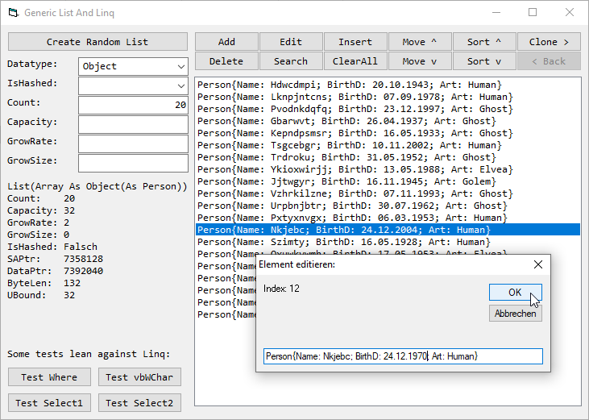

# List_GenericNLinq  
## VBC.Lists.Generic and some Linq-related functions  

 

a para-generic list-class in VBC.  
For using a container for objects in VBC we have the following possibilities:  
a) Collection  
b) Array togehter with Redim and Redim Preserve  
c) Class internally holding and using either an Array or a Collection or both  
  
a) Collection  
Pro: 1) can hold arbitrary datatypes (except for Udts not coming from tlb/axdll)  
Pro: 2) already has some useful functions like: Add, Count, Item, Remove, For Each  
Pro: 3) already has some basic hashing-functionality  
Contra: 1) Memory comsumption can be rather high, because every element (even byte) is stored as a Variant (=16byte).  
Contra: 2) Data is not contained in contiguous memory   
Contra: 3) there is no possilibity for directly accessing the elements and no possibilities to access the data via pointer. You have to take the Collection-class as it is.  
  
b) Array  
Pro: 1) can hold every datatype, even non public udts (User-defined-Types, Types)  
Pro: 2) for every datatype as much memory will be consumed as the data itself, no data overhead  
Contra: 1) for every Array you need it's own function for dealing with the data. Moreover some more or less important functions are disperged anywhere in your code which maybe call Redim wo Preserve.  
  
c) Class  
if you act smart you can use best of both worlds from Collection and Array and eliminate the disadvantages:  
For sequential data use an Array, for hashing-functionality use a collection.  
  
Why para-generic?  
a generic class will be typified during design time. During compile time the compiler creates it's own class for every datatyp in use.  
there is nothing like that in VBC. If there wasn't the Variant-datatype, you had to implement it's own class for every datatype by hand by yourself.   
Thus the same code fragments are often copied over and over again. A possible extension to the class has to be copied again for each list-class.  
  
But what we can do is determining the datatype of your objects during run-time!  
during design time we just need to deal with a variable of type VBVartype, and in the list-class and from now on the datatype can be determined during run-time.   
As datapointer (resp. as Array-variable) there is a variant applied.  

Finally the list has got some functions to mimic a behaviour very much like Linq in .net.  

Project started around 2005 after wobbling around the list-class in my mind for many years and updated it constantly.
 